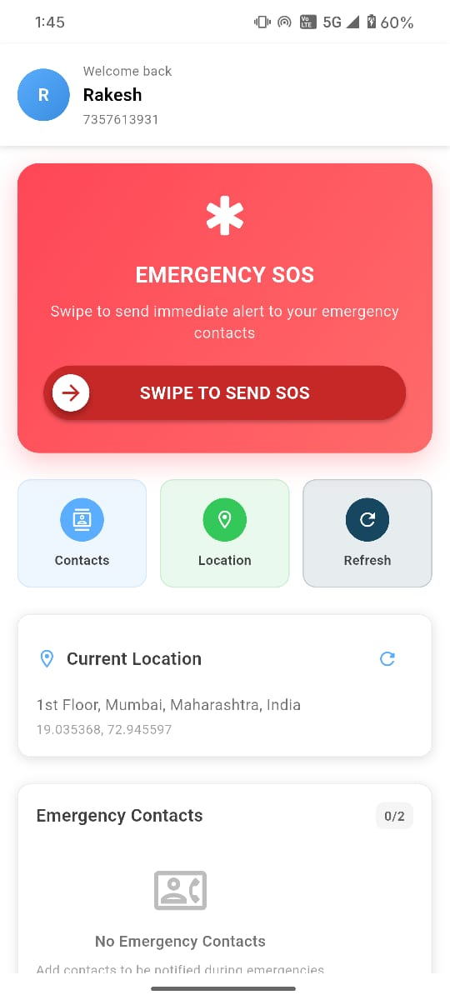
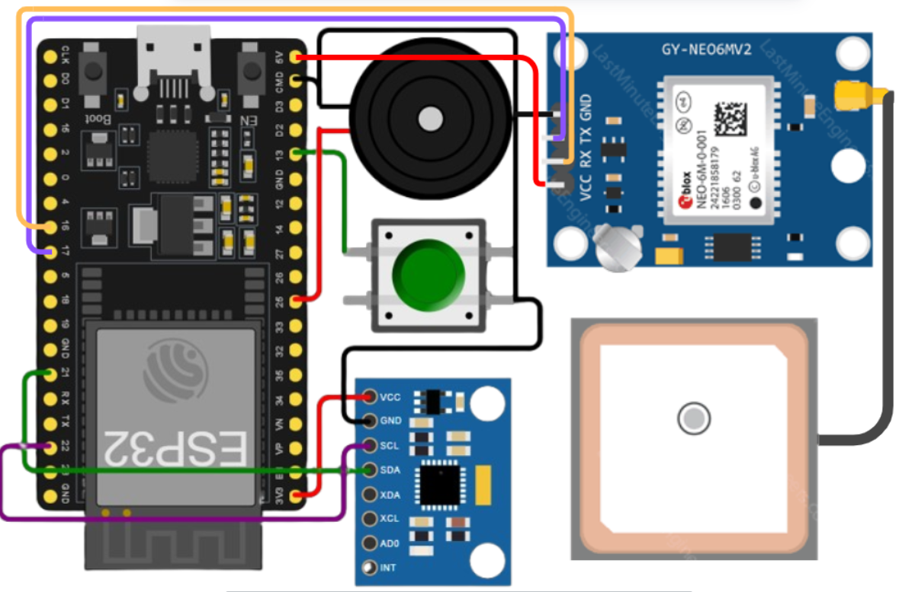

# 🚨 ResQnowApp

**A Hybrid Emergency Response System for Public Safety**  
---

## 📱 Overview

**ResQnow** is a hybrid emergency alert system designed to reduce response time in critical situations. It combines:

- A **mobile SOS app** with Slide-to-SOS functionality.  
- A **static IoT SOS button** installed in public places.  
- A **real-time dashboard** for authorities to monitor and respond instantly.

This system ensures fast, automated, and reliable emergency alerts for both smartphone users and the general public.

---
## Images

### Mobile App 

  

### Dashboard 

  

### IoT Device Prototype 

  

---

## 🎯 Aim & Objectives

- Enable **instant SOS reporting** with accurate GPS location.  
- Provide **automated alerts** to emergency authorities.  
- Support **citizens with or without smartphones**.  
- Improve **response time** and **public safety** through technology.

---

## 🧠 Methodology

**System Flow:**
User Register → Registered IoT Device
Slide SOS Button / Press IoT Button → Send Alert
→ Firebase Backend → Dashboard Monitoring

---

## 🔧 Technologies Used

| Component        | Details                          |
|------------------|----------------------------------|
| **Hardware**     | ESP32, MPU6050, GPS6M, Push Button |
| **Mobile App**   | Flutter                          |
| **Backend**      | Firebase                         |
| **Dashboard**    | HTML, JavaScript                 |
| **Live Web App** | [ResQnow Dashboard](https://rakusirvi.github.io/ResQnow/dashboard.html) |

---

## 📦 Features

- Slide-to-SOS mobile trigger  
- IoT button-based emergency alerts  
- Real-time dashboard with map and status tracking  
- User details: name, age, emergency contact, location  
- Direct map access for responders

---

## 🚀 Future Enhancements

- Autonomous drone-based assistance  
- AI-powered crash detection  
- Integration with smartwatches and vehicle sensors  
- Voice-activated SOS  
- Community awareness programs

---
## 👥 Contributors
- Rakesh Choudhary – App Development & Firebase Integration
- Anjali – IoT Hardware & Firmware
- Farhat Ansari – Web Dashboard & UI
- Sneha Jadhav – Research & Documentation
  
---
## 📚 References
- ScienceDirect Article
- Government of India, ERSS-112 Framework, Ministry of Home Affairs, 2023

---
## 📌 Social Relevance
- Faster alerts can save lives.
- Reduces manpower through automation.
- Prevents financial losses from delayed emergency response.

---
## ⚠️ Limitations
- Internet required for app-based SOS.
- IoT devices need stable power and maintenance.
- Risk of prank or accidental triggers.
- Limited coverage unless widely deployed.
- Currently supports one-way communication.
  
---
---

### License
This project is for academic and research purposes under the Aavishkar Convention.
For commercial use or deployment, please contact the authors.
